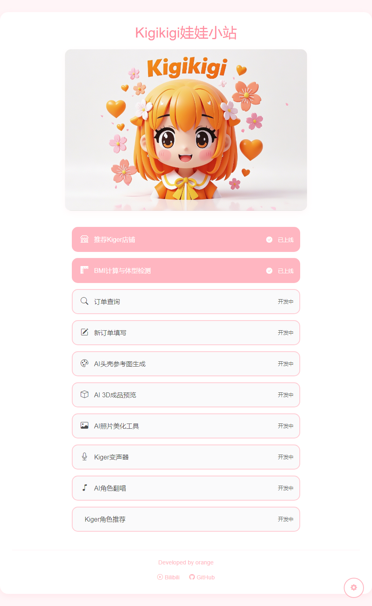
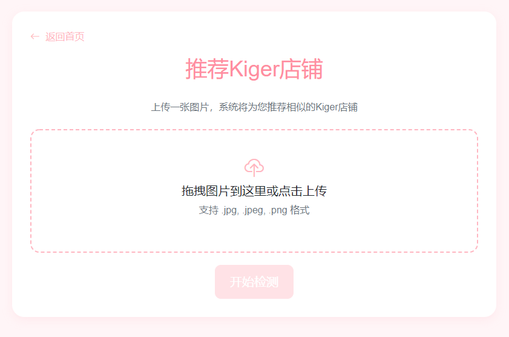
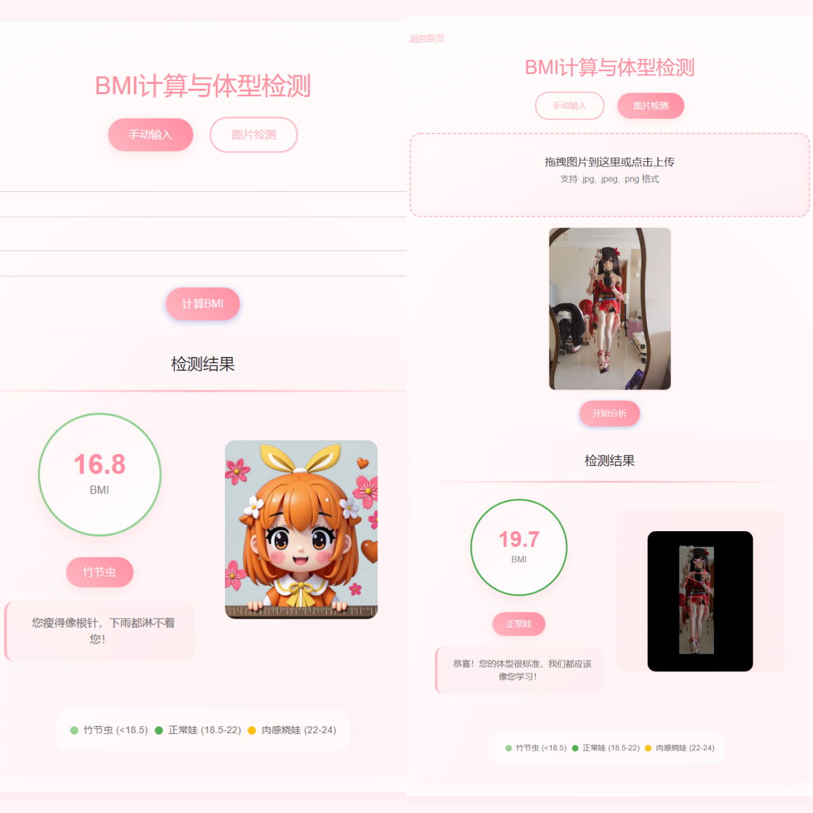

# Kigikigi娃娃小站 v0.3

一个为 **Kiger** 定制的多功能 Web 应用，集成抠图工具、图片相似度检测的店铺推荐、BMI 计算等功能，致力于提供更好的用户体验。

## 界面展示

### 主页面


### 推荐 Kiger 店铺


### BMI 计算器


## 核心功能

### 已实现功能 ✅

- 🎨 **Kiger抠图工具**
  - 动漫风格（推荐）：专为娃娃/动漫图像优化
  - 通用物体：适用于各类物体分割
    - 注意事项：
    - 建议使用动漫风格模式处理娃娃照片
    - 处理结果为透明背景的PNG图片

- 🏪 **推荐 Kiger 店铺**
  - 上传图片自动匹配相似店铺
  - 实时预览和结果展示
    - 注意事项：
    - 匹配结果仅供参考
    - 当前数据库收录店铺数量有限
  
- 📏 **BMI 检测**
  - 全身照自动分析
  - 手动数据输入计算
    - 注意事项：
    - Ai检测结果仅供娱乐

### 开发中功能 🚧

- 📦 **订单管理**
  - 订单状态查询
  - 在线订单提交
  
- 🎨 **AI 创作助手**
  - Kiger 头壳参考图生成
  - 3D 成品图/视频生成
  
- 🎤 **语音处理**
  - 实时变声器
  - AI 翻唱功能
  
- 📊 **数据分析**
  - BMI 智能推算
  - 个性化推荐

## 项目结构

```
kiger-app/
├── app.py              # 主应用入口
├── image_processor.py  # 图像处理模块
├── requirements.txt    # 依赖项
├── models/            # 模型文件
│   ├── yolov8n-pose.pt   # YOLO姿态检测模型
│   ├── isnet-anime.onnx  # 动漫风格抠图模型
│   └── u2net.onnx       # 通用物体抠图模型
├── static/            # 静态资源
│   ├── uploads/       # 上传文件
│   ├── database/      # 数据文件
│   ├── sounds/        # 音效文件
│   └── screenshots/   # 界面截图
├── templates/         # 页面模板
│   ├── index.html
│   ├── admin.html
│   ├── result.html
│   ├── bmi.html
│   ├── login.html
│   ├── remove_bg.html
│   └── similarity.html
└── images.db          # 图片数据库
```

## 使用说明

1. 确保已安装所需依赖：
```bash
pip install -r requirements.txt
```

2. 运行应用：
```bash
python app.py
```

3. 访问 `http://localhost:5000` 开始使用

## 版本历史

- v0.3: 添加 Kiger抠图工具，支持动漫风格和通用物体分割
- v0.2: 添加 BMI 检测功能
- v0.1: 首次发布，实现基础图片相似度检测