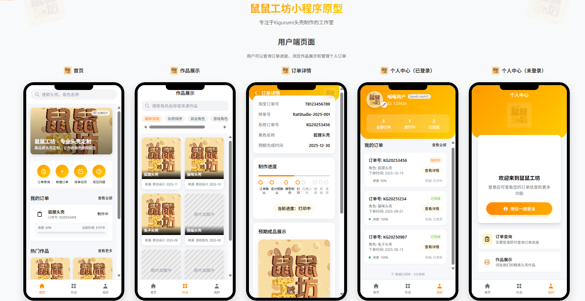
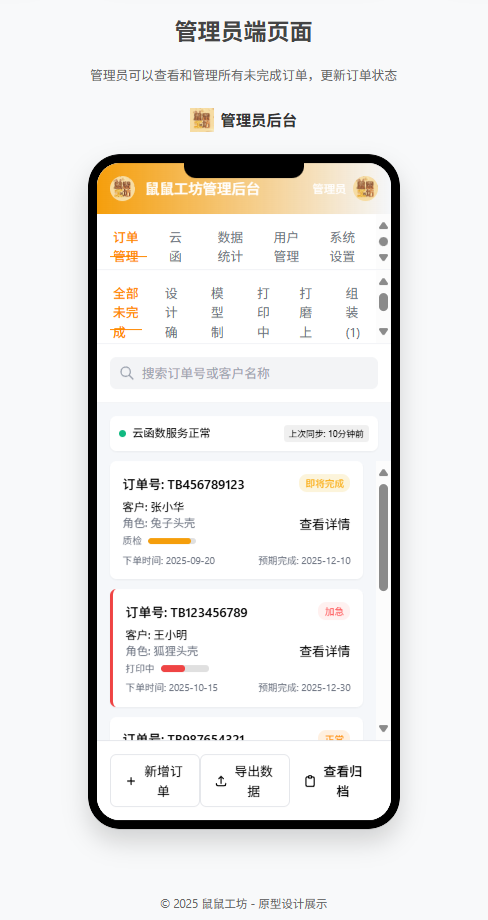

# 鼠鼠工坊微信小程序

<div align="center">
  
  <h3>专注于 Kigurumi 头壳制作的工作室小程序</h3>
</div>

## 项目简介

鼠鼠工坊微信小程序是为专注于 Kigurumi 头壳制作的工作室开发的订单管理与进度追踪平台。前端覆盖客户下单、订单查询、个人中心、社区活动等场景；后端通过微信云开发提供完整的订单生命周期管理（提交 → 审核 → 排单 → 制作 → 发货），并配备千级订单的管理后台（分页 / 批量 / 筛选 / 审核）。

PS：云端的 envId 为测试环境，字段、订单内容仅供参考。

## 功能特点

### 客户端
- **首页订单查询**：通过淘宝订单号实时查询云端进度（已对接 `getOrders` 云函数）
- **在线下单**：填写身材数据 / 角色信息 / 参考图 / 替换脸 / 加急等，提交后进入待审核状态(审核期内可自行取消,审核通过后锁定)
- **个人中心**：登录后查看个人所有订单及制作进度
- **工期计算器**：在"我的"页面入口,按"开始日期 + 工作日数"估算预计完成日(自动跳过周末与法定节假日,识别调休补班),结果仅供参考
- **作品展示 / 偶壳娃聚**：作品案例与社区活动入口
- **微信登录**：一键授权登录

### 管理后台
- **概览统计**：总数 / 待审核 / 制作中 / 加急 / 逾期 / 已完成 / 已归档 多维概览卡，可点击穿透筛选
- **筛选与搜索**：阶段 Tab、关键词模糊（订单号/客户/角色/旺旺/昵称）、日期区间、是否含归档
- **订单审核**：独立审核页（待审核 / 已通过 / 全部 Tab + 计数），支持单条与批量通过/驳回。**驳回 = 删除订单**(防止假单污染库 + 释放 tbOrderId 唯一索引槽位),驳回原因会写入客户的"驳回通知",ta 下次进个人中心会弹引导提示并跳转到下单页重新提交
- **批量操作**：选择模式 + 推进阶段 / 设为阶段 / 设加急 / 取消加急 / 分配排单号 / 解锁 / 归档 / 删除
- **新增订单**：表单与客户端字段对齐，分 6 个区块（基本 / 联系 / 身材 / 定制选项 / 排期 / 图片 / 备注），支持多图上传
- **订单详情(管理员视角)**：附加"客户信息"卡(`?admin=true` 进入时显示),展示称呼/微信昵称/旺旺/QQ/手机号,支持复制/拨打；提供"✏️ 编辑订单"全字段弹窗(基本/联系/身材/选项/排期/图片/备注),改完直接调 `batchUpdateOrders` 的 `set-fields` action 保存
- **作品管理**：维护客户端"作品橱窗"案例，分类徽章(自设/游戏/动漫)、立即预览的封面上传(支持移除重传)、批量解析云存储临时链接显示，删除带二次确认
- **危险操作**：清理测试数据（按 `queueNumber` 前缀）

## 订单生命周期

```
[客户提交]            [管理员审核]                          [开始制作]                          [完成]
status=pending  →  ─┬─ approve → status=normal       →  推进阶段 → status=completed
stage=pending       │           stage=queued             stage=modeling/...                stage=shipped
                    └─ reject  → 订单直接删除 + 通知客户
                                 (释放 tbOrderId 唯一槽位,防止假单污染库)
```

> 客户主动取消(`cancelOrder`)只在「待审核 + 未锁定」时允许,取消后订单保留为 `status=canceled` 占用 tbOrderId 槽位,如需复用须联系客服真删。三层防重单:**前端 blur 提示 → 云函数 WHERE 校验 → DB 唯一索引 `idx_tbOrderId`**。

## 输入校验（防恶意/防误填）

所有用户输入入口（下单 / 个人资料 / 后台新建·编辑订单）统一走 `miniprogram/utils/validator.ts`，提交按钮触发校验，不通过 toast 提示并阻止提交，配合 `<input maxlength>` 做软限制。**云函数侧暂未做二次校验**（前端可信前提下），后续如需加固可在 `createOrder` / `submitOrder` / `updateUserProfile` 里复用同一套规则。

| 字段 | 规则 |
|---|---|
| 淘宝订单号 | 10-20 位数字、首位非 0、非全相同数字（拦截 `0000…` / `1111…`） |
| QQ | 5-11 位数字、首位非 0 |
| 手机号 | `^1[3-9]\d{9}$` |
| 昵称 / 客户名 | 1-20 字（中文按 1 字算） |
| 角色名 | 1-30 字 |
| 淘宝名 / 角色 IP | ≤30 字（选填） |
| 身高 / 体重 / 头围 / 肩宽 | 50-250 / 20-300 / 30-80 / 20-80（cm/kg） |
| 所有文本字段 | 拦截控制字符、零宽空格 (`\u200B`)、双向覆盖 (`\u202E`) 等危险 unicode |

提示语统一鼠鼠风格，如：
- 假单号 → "鼠鼠数了下...这单号好像在糊弄人喵 (≧へ≦)"
- 手机号格式错 → "这个号码鼠鼠拨不通喵，麻烦填 11 位真手机号~"
- 含零宽字符 → "里混进了奇怪的看不见的字符喵，重新输入一下吧~"
- 身高超范围 → "身高超出鼠鼠的尺子啦，正常值 50–250 之间喵~"

## 制作流程

对外展示 **5 个阶段**（`OrderStage`）：

| 阶段 | 标签 | 进度 |
|---|---|---|
| `queued` | 已排单 | 10% |
| `modeling` | 建模 | 30% |
| `painting` | 上妆 | 55% |
| `hair` | 假毛 | 80% |
| `shipped` | 已发货 | 100% |

> **后续可选增强：**
> - 内部子状态 `subStage`（如：建模 → 3D 建模 / 打印；上妆 → 打磨 / 喷漆），对外仍展示 5 阶段
> - 客户留言 / 订单评论时间线
> - 物流单号录入与订阅消息自动推送

## 下单字段（客户端 / 后台共用）

提交后进入待审核状态(可自行取消),审核通过后锁定,如需修改请联系客服解锁。

- **基本**：淘宝订单号、角色名、角色所属 IP
- **身材**：身高 / 体重 / 头围 / 肩宽
- **参考图**：多视角参考图（最多 3 张）
- **配饰**：是否需要配饰
- **替换脸**：是否需要 + 数量（1-3 张），每张对应一张表情参考图
- **加急**：+1200 元
- **备注**：客户特殊需求

## 数据结构

订单核心类型集中在 `miniprogram/types/order.ts`，所有页面统一引用：

- `OrderStatus`: `pending | normal | urgent | canceled | completed` (驳回不再保留状态,订单直接删除)
- `OrderStage`: `pending | queued | modeling | painting | hair | shipped`
- `Order` 字段：基本信息 / 时间 / 进度 / 状态 / `userInfo` / `bodyMeasurements` / `options` / 图片 / `reviewInfo`

## 技术栈

- 微信小程序原生开发（glass-easel Component）
- **TypeScript**（启用 `useCompilerPlugins: ["typescript"]`，页面层全量 .ts）
- TDesign 微信小程序组件库
- 微信云开发（云函数 + 云数据库 + 云存储）

## 项目结构

```
miniprogram/
  ├── app.json / app.ts / app.wxss
  ├── types/                     # 共享 TS 类型
  │   ├── order.ts               # Order / OrderStatus / OrderStage / STAGE_FLOW
  │   └── user.ts                # UserInfo / UserProfile
  ├── assets/                    # 静态资源（图标、图片）
  ├── pages/
  │   ├── index/                 # 首页（订单查询入口）
  │   ├── order/                 # 客户下单
  │   ├── order-detail/          # 订单详情（含进度时间轴）
  │   ├── profile/               # 个人中心
  │   ├── work-day-calc/         # 工期计算器(对接 timor.tech 节假日 API)
  │   ├── works/                 # 作品展示
  │   ├── gathering/             # 偶壳娃聚
  │   ├── admin/                 # 管理后台
  │   │   ├── admin.ts/.wxml     # 主页面（列表 + 概览 + 批量）
  │   │   ├── order-review/      # 订单审核子页
  │   │   └── works-manage/      # 作品管理子页
  │   ├── webview/               # WebView（外部链接）
  │   ├── logs/                  # 日志页
  │   └── common/                # 通用样式
  └── utils/

cloudfunctions/
  ├── adminAuth/                 # 管理员鉴权
  ├── login/                     # 登录获取 openid
  ├── getOpenId/                 # 获取 openid
  ├── updateAvatar/              # 更新头像
  ├── submitOrder/               # 客户端提交订单（含图片上传后续处理）
  ├── createOrder/               # 后台新建订单（与 Order 结构对齐）
  ├── getOrders/                 # 订单列表（分页/筛选/搜索/计数）
  ├── getOrderDetail/            # 订单详情
  ├── batchUpdateOrders/         # 批量操作（推进 / 审核 / 加急 / 归档 / 解锁 / 删除）
  ├── clearOrders/               # 清理测试数据
  └── initOrderData/             # 初始化示例数据

prototype/                       # 设计原型
```

## 原型设计

```
prototype/
  ├── admin.html / index.html / home.html
  ├── order-detail.html
  ├── profile.html / profile-unlogin.html
  └── ...
```

## 安装与运行

1. 克隆仓库
   ```bash
   git clone https://github.com/your-username/ratstudio-miniprogram.git
   ```
2. 使用微信开发者工具导入项目根目录
3. 在 `project.config.json` 中确认开启 TS 编译插件（`useCompilerPlugins: ["typescript"]`）
4. 配置云开发环境 ID（`miniprogram/app.ts` 与 `cloudfunctions/cloud-env.json`）
5. 上传部署所有云函数（首次或修改后）
6. **配置 request 合法域名**(用到了外部节假日 API):
   - 微信公众平台 → 开发管理 → 开发设置 → 服务器域名 → request 合法域名 添加 `https://timor.tech`
   - 本地调试可在开发者工具勾选"详情 → 本地设置 → 不校验合法域名"临时跳过
7. 编译运行

## 外部依赖

| 用途 | 服务 | 说明 |
|---|---|---|
| 法定节假日数据 | `https://timor.tech/api/holiday/year/{YYYY}` | 公共免费 API,按年拉取,本地 `wx.storage` 缓存 30 天;失败时降级为"仅按周末计算" |

## 项目截图

<div align="center">
  <h3>用户端界面</h3>
  

  <h3>管理员后台</h3>
  
</div>

## 开发进度

- [x] 项目初始化
- [x] 首页 / 订单详情 / 个人中心 / 作品 / 偶壳娃聚
- [x] 客户端下单流程（含锁定 + 订阅消息）
- [x] 云函数：登录 / 订单 CRUD / 批量操作 / 审核
- [x] 管理后台（列表 / 概览 / 筛选 / 批量 / 新增）
- [x] 订单审核子页（通过 / 驳回 / 计数;驳回 = 直接删除 + 客户端弹窗引导重新下单）
- [x] 防刷假单:tbOrderId 唯一索引 + 驳回即删 + 二次元友好提示文案
- [x] 输入校验:统一 validator(QQ/手机号/订单号/身材范围/危险 unicode 拦截)
- [x] 共享 TS 类型迁移
- [x] 工期计算器(节假日 API + 多年缓存)
- [x] 全站 UI 美化(首页装饰背景 + 工期计算器视觉重做 + 二次元俏皮文案)
- [x] 作品页/作品管理 UI 美化(骨架屏 + 分类徽章 + 上传预览)
- [x] 管理员可编辑客户提交的订单全字段(详情页弹窗)
- [x] 待审核订单用户可自助取消(审核通过后自动锁定)
- [x] 资料/订单页 UX 收尾(身材数据快捷入口、淘宝旺旺保存即时刷新、上传组件改原生)
- [x] 视觉系统统一(主按钮 135° 暖橙渐变 / 次级按钮白底橘描边 / 背景装饰降噪)
- [x] 首页布局重排 + 文案二次元化(排单优先 / 服务卡精简 / FAQ 加温度)
- [ ] 物流单号录入 + 订阅消息自动推送
- [ ] 内部子状态 `subStage`
- [ ] 上线发布

## 文案风格

客户端面向用户的提示统一走"二次元 / 俏皮"路线,管理后台保持简洁专业。

| 场景 | 文案 |
|---|---|
| 加载中 | 鼠鼠在搬数据~ / 鼠鼠正在算... |
| 加载失败 | 咦,加载迷路了 / 信号迷路了,再试一次? |
| 复制成功 | 复制好啦~ |
| 登录成功 | 欢迎回来呀~ ✨ |
| 提交成功 | 提交成功啦~ ✨ 订单已交给鼠鼠~ |
| 开发中入口 | 这个被你看到啦~ 还在赶工中 |
| 订单不存在 | 咦,这只订单跑掉啦~ |
| 空状态 | 还没有订单呢~ 快去定制一只吧 ✨ |
| 作品加载更多 | 多来点 求求了 ↓ |

## 版权信息

© 2026 鼠鼠工坊 - 保留所有权利
